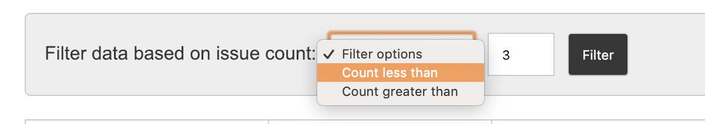

# IssueManager

This project's main goal is to show issues from log file uploaded via input field, along with facility to filter data based on least number of issues.

 **How to run this application:**
 + open terminal and run 
 
        npm install 
   Wait until all the dependency in pulled into node_modules folder
 
 + once install is done, run 
           
       npm start 
  This will start the server at http://localhost:4200/
 
  **How to run test:**
  + open terminal and run 
  
        npm test  
  This will start karma server to run unit test
  
  + if you would like to see the coverage or more details about unit test run _**ng test --code-coverage=true**_  
  
 **Technical details:**    
   + Framework : **Angular@6**  
   + Templating : **HTML**   
   + Style compiler : **SASS**  
   + state management : **ngxs**   
   + unit test : **Karma, Jasmine**
    
   **Application key features:**   
   Since key focus of the application is to handel issue log, 
   following features will help user to search issues based on issue count:  
     
   +  **Sorting list based on count**  
   Sorting buttons are present in the head of the count column as show below:  
   
       
   
  + **Sorting list based specific value**  
   Sorting also can be done by filter issue count less or greater than a value entered:  
    
   
   
   
    
    
    

